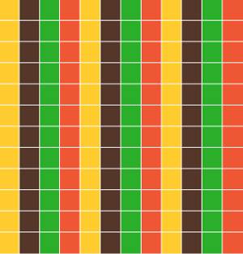

# Patchwork

A JavaScript library for creating a dynamic and responsive media grid in the browser. [Visit the site](http://tgolson.com/patchwork/) for a sample.


## What's that mean?

Standard responsive grids are great for lots of things, but what if you want to cover an entire area in a grid? What if that grid needs to hold its form as the viewport size changes? Most responsive grids will elongate elements, but in a media layout more elements may need to be added. That's where Patchwork comes in.

## Get Started

First [download](http://tgolson.github.io/patchwork/js/patchwork.js) the Patchwork JavaScript file. Then, place the file into your project and link it to your HTML pages (make sure to include jQuery - Patchwork heavily depends on it).

```html
<script src='js/libs/jquery-1.11.0.js'></script>
<script src='js/patchwork.js'></script>
```

Then add the ```patchwork``` id to a div.

```html
<div id='patchwork'></div>
```

And boom - Patchwork. Depending on your settings, you might get something like this:

```html
<div id="patchwork" style="width: 1301px; height: 411px;">
  <div id="patch0" class="patch" style="width:216.83333333333334px; height:205.5px; display:inline-block;">
    <span class="white-space-remover" style="font-size:0px;visibility:hidden">.</span>
  </div>
  <div id="patch1" class="patch" style="width:216.83333333333334px; height:205.5px; display:inline-block;">
    ...
  </div>

    ...

  <div id="patch11" class="patch" style="width:216.83333333333334px; height:205.5px; display:inline-block;">
    ...
  </div>
</div>
```

## Examples

All files are kept in the ```examples``` directory within this project. Refer to them for additional tips on syntax and styling.

[Full Patchwork](http://tgolson.com/patchwork/examples/full_patchwork.html) - An example of using Patchwork's default settings to fill up an entire page with patches.

[Nested Patchwork](http://tgolson.com/patchwork/examples/nested_patchwork.html) - An example of placing Patchwork into a container to limit it's size.

[Patch Size](http://tgolson.com/patchwork/examples/patch_size.html) - An example of setting the target patch size properties for the patchwork. NOTE: This example has a white border at the bottom in Chrome - possible bug fix needed.

[Outlines](http://tgolson.com/patchwork/examples/outline.html) - An example of using the CSS ```outline``` property to add styling. NOTE: This example has a white border at the bottom in Chrome - possible bug fix needed.

## Patchwork is smart

Patchwork is useful because it takes a lot of worry out of the developer's hands. First, it looks for the ```div``` element with ```id='patchwork'```, then it assesses the parent element to see if it's being put into a wrapper. Then it looks at the desired patch sizes, and runs a calculation based on the current screen size to come up with patch sizes that will fill the entire screen with no remainder, while staying close to the desired size.

Oh ya, and it refreshes the calculations on screen resize. So what was once a 6 x 3 grid may change to a 3 x 3 grid if the browser if scaled or zoomed.

**Parent Elements**

One of the most useful things about Patchwork is that is can easily be wrapped inside a parent element. For example, say you have a 400px by 300px area you want to put Patchwork into. Simple:

```html
  <div style="width:400px;height:300px;">
    <div id='patchwork'></div>
  </div>
```

Patchwork will look up at the parent element, and create itself with those dimensions, inside the parent element.

What if you don't place it into a wrapper ```div```? Then Patchwork will default its parent to the entire ```body``` element, taking up the full window. In many cases this is likely the desired outcome.

## Customization

Currently Patchwork is designed to be quick and simple, so not too many customizations are built in. Hopefully the remainder of the work can be done in CSS or SASS. In the future, a suite of quick addons will be released under Patchwork Toolbox. That being said, here are a few ways to change the experience:

**Change the target patch size**

Patchwork scales based on a desired size for the patches. These can be set in the ```patchwork.js``` file, or via data-attributes, which are recommended if importing the JavaScript externally.

Changing in the JavaScript file:

```javascript
var Patchwork = {
  ...
  targetPatchSize: {
    X: 100,
    Y: 100
  },
  ...
}
```

Or, setting via data-attributes:

```html
<div id='patchwork' data-target-size-x='100' data-target-size-y='100'></div>
```

**Set the number of unique patch styles for smart rendering**

If you've played around with the Patchwork a little you might notice that sometimes similar patches can become aligned and look like columns, like this:



Luckily, Patchwork don't play that. Simply pass in the number of styles you plan on using via the ```data-style-sets``` attribute, like so:

```html
  <div id='patchwork' data-style-sets="4"></div>
```

An voila, the not wanted aligned columns transforms into a nice pattern:


## Important things to know

* Because of the [white space added](http://davidwalsh.name/remove-whitespace-inline-block) by the ```inline-block``` styling, each patch receives a small text character (a period), which is set to a ```font-size``` of zero and made invisible.

* ```overflow``` is automatically set to ```hidden``` on the parent element for spacing issues. If you want overflow, manually add it back in and test to see if there are spacing issues.

* Patchwork begins to hit bugs and slow down when the patch target sizes are set below ```50px```. This isn't really the intended application, and ideally, most installs should keep the target sizes above ```50px``` each.

* ```<!DOCTYPE html>``` needs to be declared or patch sizing refresh might be off.

* Using the CSS ```border``` property adds to the width of elements and will break the patch structure. Use ```outline``` instead - like [this](http://tgolson.com/patchwork/examples/outline.html)

* Sometimes the patches will line up like columns, diminishing the graphical impact. Just know it's always a possibility when using a dynamic framework.

## Todo / Known Issues

* Chrome looks to add whitespace at the bottom of patchworks with smaller patches.
* Create more elaborate examples with SASS
* Take in more data attribute args
* Work on Patchwork Toolbox for quick, common styles

## Contributing

1. Fork it
2. Create your feature branch (`git checkout -b my-new-feature`)
3. Commit your changes (`git commit -am 'Add some feature'`)
4. Push to the branch (`git push origin my-new-feature`)
5. Create new Pull Request
